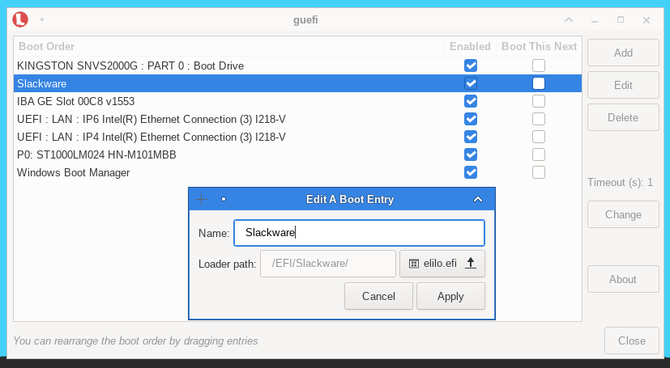

ABOUT
=====

**GUEFI** is a Python/GTK+3 application that acts as a frontend for
[efibootmgr](https://github.com/rhinstaller/efibootmgr). It provides
an easy to use interface for managing UEFI boot options.

Using GUEFI you can:
* Create a new UEFI boot entry
* Edit a UEFI boot entry *
* Delete a UEFI boot entry
* Change the UEFI boot order
* Enable/disable a UEFI boot entry
* Configure a UEFI boot entry to be the default during the next boot
only

Editing a boot entry
--------------------

Since efibootmgr does not really provide means for editing an existing
UEFI boot entry, what GUEFI actually does is a two step process that
involves creating a new boot entry, making sure all attributes of the
original boot entry that haven't been changed by the user are copied over,
deleting the original boot entry and then making sure the new boot entry
is placed in the same position as the original one was. That means that
the actual BootNum of the new boot entry is not the same as the original
one. It's kind of a hackjob, but it works.

REQUIREMENTS
============

* A GNU/Linux PC running a UEFI firmware
* Python >= 3.9
* GTK+3 >= 3.24.x
* efibootmgr 17

Some older versions of these might also work, but they have not been
tested. It has been tested only with efibootmgr version 17. Any
older or newer version might not work properly. If it doesn't work with
a newer version, please report it.

TRANSLATIONS
============

The GUEFI interface fully supports localization. If you want to
translate it to a new language, or edit/fix something in an existing
translation, you can do that using Transifex and the respective
[GUEFI resource](https://www.transifex.com/gapan/salix/guefi/).

